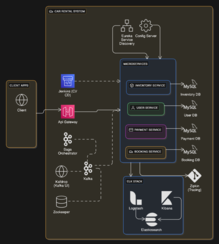

# Car Rental Microservice Project

TL;DR:

 -- A study project to employ modern web development techniques. ****The system is built to provide users a catalog of cars to be rented for a period of time.** The front end was built with the **Next js** 15 framework, many of the features available in the framework was used to make concise and simple, yet effective, UI code. Such features as next-auth, server side rendering, action-states and many others.

 -- The back end was built using the extremely famous Java's framework **Spring** together with a microservice architecture system design. Spring's tools and ecosystem was extensivily used to various purposes. Spring data JPA was used to handle the repositories. Spring Boot to manage auto-configurations. Spring Security to handle authorizations with a hybrid system using a JWT approach together with oauth social authentications. I integrated the system with Mercado Pago SDK to handle the payment processing. MySQL was chosen for the database managent system for all services and Kafka to handle transactions in the system.

 --All systems in the project was made into a docker image uploaded to dockerhub. Also jenkins pipelines  were created for the microservices ci/cd. Now for the more detailed description of the project.

---

**Summary:**
1.  Introduction
2.  Back-end Architecture
3.  Front-end 
---

1.  **Introduction**

    There was a time where microservices was all the hype around web development, videos on YouTube, articles around the around the world. It seemed like every developer was a creating a microservice system and thid design decision solved all the problems in the world. That's what was going on when I was a beginner developer, so I started learning how to create microservices. Enrolled on many courses that promised me to teach microservices, watched many videos on about the topic, read articles, and all seemed really great. The thing is for a learning perspective, microservices are hard, like, really hard they are hard to design very well, hard to code, introduces a lots points of failure, even hard to justify this design choice now a days. Given that, what happened was most of the time  the courses and the people that promised teaching microservices never presented a course or tutorial that ***REALLY*** had a microservice project approach. All of them had some or lots of anti-pattern regarding the architecture, sometimes they shared the same database or same repository on git, they never showed how to deal with asynchronous commmunication, nor talked about retries and dealing with failures. Because of the complexity that comes with the architecture most projects presented in those courses were just simplistic simulations of some routine, that in no way resembled a usefull software. Designing a system with microservices approach is quite different from regular monolith way, that is why I came up with the present project, to devise a microservice project with moderate complexity staying as close as I could to a real microservice project.

    The core idea is very simple, a website users can create an account and rent a selected car from a catalog for a period of time, much like many e-commerces out there. Then I overengineered the system with everything I thought relevant to the project, designing the core renting functionality into an asynchrounous communication between some microservices. To put the project in practice I used spring the create the mentioned services and used nextjs to build the front end application.
2.  **System Design**

    

    The main idea for the system is to use a microservice approach to the create the main car renting feature. With that in mind I created four microservices, the inventory microservice, the user microservice, the payment microservice and finally the booking microservice. All of them working as independently as possible from each other, each of the microservices have their own database schema, their own git repository, their own ci/cd pipeline.

    The inventory microservice is responsible for keeping track of the cars the company would have at it's disposal. The database of this service has info of the cars availability, also the car's renting price and details. The user microservice is responsible for the management of the users registration and login to the system through JWT's, also keep tracks of users' sensible information. The payment microservice is responsible for processing the payment transactions, also it connects with a third party payment gateway, particularly I chose the Mercado Pago system. Finally the booking microservice handles the renting details such as the reservation, the total price calculation and schedulling.

    The core functionality now comes through connecting these microservices together. To rent a car a transaction takes place, in a monolith application this is straightfoward e probably would have a couple of services and it would be a matter of just calling the repositories' methods. In a microservice setting this is a bit trickier. As we can't simply wrap all the cross-service operations together we need a different approach, I then chose implement the Saga Pattern.

    To handle the transaction of the core functionality I used an Orchestration Saga Pattern, where we implemented a separate service that would take the rent request from the user and then coordinate the microservices through a sequence of steps and triggers. The orchestrator starts by telling the inventory to check the availability of the car chosen for rent, if the car is available the orchestrator tells the booking service place a reservation I schedule and price, once this info is available the orchestrator then commands the payment service to issue a payment, this service will use the info from frontend to create a payment in the Mercado Pago API and store info about the payment, then the Saga will be completed. If any of the steps fails the orchestrator will then command each service with a compensating action in order to rollback any change made prior the failure.
    
     The communication between the orchestrator and services are done through events and command using the publisher/subscriber design. I stablished the channels between the orchestrator and the microservices and the orchestrator publishes commands and the microservices as subscribers listens to them in order to trigger their processing. Likewise the microservices also publishes an event based on the processing, and the orchestrator, as a subscriber, will listen to the event and decide based on it what to do next, deciding if it should trigger a next step or command prior services to rollback.

    I chose to end the saga in the payment step due to the behavior of Mercado Pago API, mainly in their test environment, some more code should be written to handle the payment webhook once the payment is completed or not but their webhook is not very nice to work with so I decided to just end it in the payment step.

    Other than that our system also has a gateway to act as the entrypoint of our system and all request will be redirect by it to the according service. A microservice approach really shines in a kubernetes setup that can really utilizes the power of k8s  providing robust orchestration, auto-scaling, and self-healing of individual microservices, making the entire system highly resilient, scalable, and much easier to manage. However, kubernetes are expensive so I was unable to introduce them here. Nevertheless, as I already did the work the project will be presented here with docker images for the services and a docker compose to run them in a docker environment.

2.  **Back-end Architecture:**

    Now let's explore in greater details the implementation of the system discussed, the core functionality and the business model is built in the backend, to accomplish this I chose the Spring ecosystem, so I used Java to build the systems. All microservices are Spring projects, utilizing SpringBoot to handle auto configurations, within each microservice there is a layered designed project with very specific purposes.

    The inventory microservice main functionality is to handle the car's availability and details. Using spring data JPA to manage the the repositories and query methods, I used common spring's annotations to create to create a Rest controller to expose some endpoints, mainly for internal use. Used @ControllerAdvice to create a global exception handler in order to provide a centralized error handling system. Added configuration files to make use of kafka's message systems, adding both a consumer and producer configs.

    The user service is very special, one of my main goals with this project was to put forth a system that could handle a custom login system together with social logins, so I used the oauth2 protocol to handle the authentication. The user can get the the access token from the google and github providers, then our system will validate those token and decide which endpoints are accessible or not, this decision is made on each microservice through the Spring security's authentication manager and token decoders. I chose google and github due to them having different tokens, google uses an opaque token whereas github use a non-opaque token. Together with this to allow also a custom credentials login where the system keeps track of the user. I used Spring security to and NimbusDecoder to create decoders that handle the tokens system. **As of now the orchestrator service is the only one that has the config files for this configuration** most of the other microservices aren't with the auth code...yet.

    The booking service is quite simple, responsible for the schedule of the rent, a the total price calculation, much like the others uses spring data JPA to handle the repositories, has the kafka producer and consumer config.

    The Payment microservice is another special one, other major goal I had was to integrate my system with a real third party payment gateway, so I chose Mercado Pago SDK to work with mainly beacause i wanted to provide the credit card and pix payment options. For most part it was simple just a matter of creating the appropriate Payment instance the SDK itself makes the request internally to the mercado pago own system to create the payment. Also the configuration class of the SDK is super simple. the only downside was that in a test environment there is no way to update the pix payment status its always set as pending, it's actual a bummer for this project. Aside from that we have the usual repositories,services and kafka configs.

    The configuration of all these microservices are served through a config server. I have a private config repo where I store all config files for the project, using the Config server from the Spring Cloud project this setup provides a single, version-controlled source of truth for all application settings, allowing microservices to retrieve their necessary configurations dynamically. Also, we have an Eureka Server to handle service registration and discovery for all our microservices. Each microservice registers itself with Eureka upon startup, making its location and capabilities known to the rest of the system. This allows other services to find and communicate with each other dynamically, without needing to hardcode IP addresses or ports.

2.  **Front-end (Client Application):**

