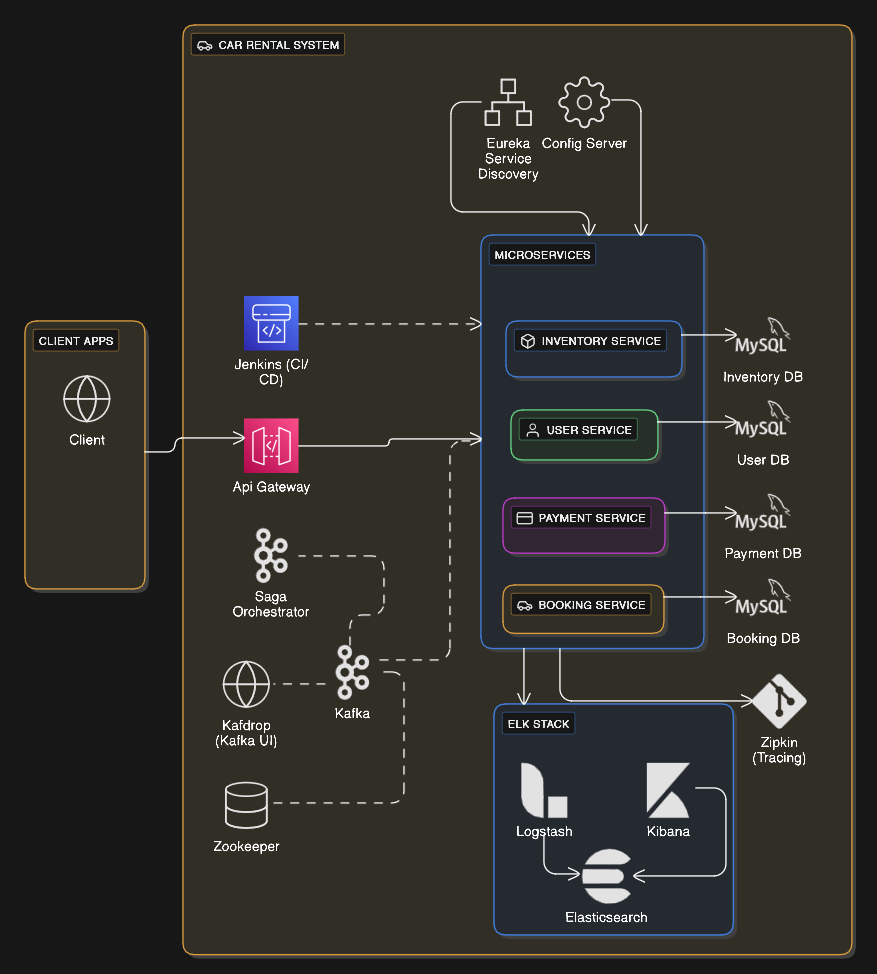

# Car Rental Microservice Project

(Portuguese Version at the end) TL;DR:

-- A study project to employ modern web development techniques. The system is built to provide users a catalog of cars to be rented for a period of time. The front end was built with the **Next js** 15 framework, many of the features available in the framework was used to make concise and simple, yet effective, UI code. Such features as next-auth, server side rendering, action-states and many others.

-- The back end was built using the extremely famous Java's framework **Spring** together with a microservice architecture system design. Spring's tools and ecosystem was extensivily used to various purposes. Spring data JPA was used to handle the repositories. Spring Boot to manage auto-configurations. Spring Security to handle authorizations with a hybrid system using a JWT approach together with oauth social authentications. I integrated the system with Mercado Pago SDK to handle the payment processing. MySQL was chosen for the database managent system for all services and Kafka to handle transactions in the system.

--All systems in the project was made into a docker image uploaded to dockerhub. Also jenkins pipelines were created for the microservices ci/cd. Now for the more detailed description of the project.

---

**Summary:**

1.  Introduction
2.  System Design
3.  Back end implementation
4.  Front end application
5.  Elasticsearch, Logstash and Kibana
6.  CI/CD and Docker
7.  Wrap up and conclusions
---

1 **Introduction**

There was a time when microservices were all the hype in web development, with videos and articles about them flooding the internet. It seemed like every developer was creating a microservice system, and this design decision was presented as a solution to all the world's problems. That's what was happening when I was a beginner developer, so I started learning how to create microservices. I enrolled in many courses that promised to teach me microservices, watched countless videos on the topic, and read numerous articles. All of it seemed great.

The thing is, from a learning perspective, microservices are hard—really hard. They are difficult to design well and to code, they introduce many points of failure, and it can even be hard to justify this design choice nowadays. Because of this, most of the courses and people who promised to teach microservices never presented a course or tutorial that really had a true microservice project approach. Many of them included anti-patterns in their architecture, sometimes sharing the same database or Git repository. They never showed how to deal with asynchronous communication, nor did they talk about retries and handling failures. Due to the complexity that comes with the architecture, most projects presented in those courses were simplistic simulations of a routine that in no way resembled useful software.

Designing a system with a microservices approach is quite different from the regular monolith way. That is why I came up with this project: to devise a microservice project with moderate complexity while staying as close as I could to a real-world microservice project.

The core idea is very simple: a website where users can create an account and rent a selected car from a catalog for a period of time, much like many e-commerce sites out there. Then, I intentionally "overengineered" the system with everything I thought was relevant to the project, designing the core rental functionality with asynchronous communication between several microservices. To put the project into practice, I used Spring to create the services and Next.js to build the front-end application.

---

2 **System Design**

The main idea for the system is to use a microservice approach to provide the main car renting feature. With that in mind, I created four microservices: the inventory microservice, the user microservice, the payment microservice, and finally, the booking microservice. All of them work as independently as possible from each other. Each of the microservices has its own database schema, its own Git repository, and its own CI/CD pipeline.

The inventory microservice is responsible for keeping track of the cars the company has at its disposal. The database for this service has information on the cars' availability, as well as the car's rental price and details. The user microservice is responsible for managing user registration and login to the system through JWTs, and also keeps track of users' sensitive information. The payment microservice is responsible for processing payment transactions and connects with a third-party payment gateway; I particularly chose the Mercado Pago system. Finally, the booking microservice handles the rental details, such as reservations, total price calculation, and scheduling.

The core functionality of our system comes from connecting the microservices. In a monolith application, a car rental transaction would be straightforward, likely involving a few service calls to repository methods. In a microservice setting, this is a bit trickier. Since we can't simply wrap all cross-service operations into a single transaction, we need a different approach. I chose to implement the Saga Pattern.

To handle the core transaction, I used an Orchestration Saga Pattern. This involved a separate service, the orchestrator, which takes the rental request from the user and coordinates the microservices through a sequence of steps. The orchestrator first tells the inventory service to check the availability of the chosen car. If the car is available, the orchestrator tells the booking service to create a reservation, schedule, and price. Once that information is available, the orchestrator commands the payment service to issue a payment. This service uses information from the front end to create a payment in the Mercado Pago API and stores the payment details. The saga is then considered complete. If any of these steps fail, the orchestrator commands each service to perform a compensating action to roll back any changes made before the failure.

Communication between the orchestrator and the microservices is handled through events and commands using the publisher/subscriber design pattern. The orchestrator publishes commands, and the microservices, acting as subscribers, listen to them to trigger their processing. Similarly, the microservices publish events based on their processing results. The orchestrator, as a subscriber, listens to these events and decides the next course of action, whether it's to trigger the next step or command previous services to roll back.

I chose to end the saga at the payment step due to the behavior of the Mercado Pago API, particularly in its test environment. While more code could be written to handle the payment webhook once a payment is completed, the webhook is not very straightforward to work with, so I decided to conclude the saga at this point.

Other than that, our system also has an API gateway to act as a single entry point. All requests are redirected by it to the appropriate service. A microservice approach truly shines in a Kubernetes setup, which can leverage its power to provide robust orchestration, auto-scaling, and self-healing for individual microservices, making the entire system highly resilient, scalable, and much easier to manage. However, since Kubernetes can be expensive, I was unable to introduce it here. Nevertheless, as the groundwork has been laid, the project will be presented with Docker images for the services and a Docker Compose file to run them in a local Docker environment.

---

3 **Back end Implementation:**

Now, let's explore in greater detail the implementation of the system. The core functionality and business logic are built in the backend. To accomplish this, I chose the Spring ecosystem, using Java to build all the microservices. Each microservice is a Spring Boot project, leveraging its auto-configuration capabilities. Internally, the services follow a layered architecture, with clearly separated responsibilities.

The Inventory microservice is responsible for managing car availability and details. I used Spring Data JPA to manage repositories and query methods efficiently. The REST endpoints are exposed via a controller annotated with standard Spring MVC annotations, primarily for internal communication. For centralized error handling, I used @ControllerAdvice to define a global exception handler. This service is also integrated with Kafka: I created both consumer and producer configurations to enable event-driven communication within the system.

The User microservice plays a particularly important role. One of my main goals in this project was to support both custom login credentials and social login providers. To achieve this, I implemented authentication using the OAuth2 protocol. Users can authenticate via GitHub or Google; the system then validates the access tokens and determines which endpoints are accessible based on token verification. This is enforced in each microservice through Spring Security’s AuthenticationManager and token decoders. I intentionally chose GitHub and Google because they provide different types of tokens — GitHub uses non-opaque tokens, while Google uses opaque ones — allowing me to design a more robust and flexible authentication strategy.

In addition to social login, the system also supports a custom credentials-based login, which involves managing user records internally. For this, I used Spring Security along with NimbusJwtDecoder to build the token handling infrastructure. Currently, only the orchestrator service contains the full authentication configuration; most of the other microservices have not yet been updated to enforce auth validation.

The Booking service is relatively simple. It is responsible for scheduling rentals and calculating the total rental price. Much like the other services, it uses Spring Data JPA for managing database repositories and includes Kafka producer and consumer configurations to communicate with other components in the system.

The Payment microservice is another special component of the system. One of my major goals was to integrate a real-world third-party payment gateway, so I chose the Mercado Pago SDK, primarily to support both credit card and PIX payment methods. For the most part, the integration was straightforward — it simply required creating the appropriate Payment instance, and the SDK would internally handle the API request to the Mercado Pago platform. The SDK configuration itself is minimal and easy to work with. However, a notable limitation in the test environment is that PIX payment statuses cannot be updated, and they are always marked as "pending", which is a significant drawback for testing full payment flows in this project. Aside from the Mercado Pago integration, this microservice follows a similar structure as the others, with layers for repositories, services, and Kafka messaging infrastructure.

All microservice configurations are managed through a centralized Config Server, using Spring Cloud Config. I maintain a private configuration repository that stores all application settings in a version-controlled manner. This setup enables each service to dynamically retrieve its required configurations at runtime, promoting consistency and maintainability across the system.

Additionally, the system includes an Eureka Server for service discovery and registration. Each microservice registers itself with Eureka upon startup, enabling other services to locate and communicate with it dynamically, without needing to hardcode IP addresses or port numbers. Finally, I used Spring Cloud Gateway to build an API Gateway, which acts as the unified entry point for the backend system. It routes incoming requests to the appropriate microservices.

For the core functionality of the project, I needed an Orchestrator service to implement the Saga Pattern. This service was created specifically to handle that responsibility. Its controller is responsible for starting the Saga and initiating the rental process. The service includes Kafka producer and consumer configurations, as well as Spring Security configuration. The Saga will only be initiated if the user is authenticated, whether through the project's custom credentials or via social login. The Orchestrator listens to events published by the microservices and responds accordingly.

---

4 Front end Application

To implement the UI of the project, I chose to use Next.js. Having studied React for a couple of years now, I feel pretty comfortable coding with it, so I decided to use the most recent version — Next.js 15. I saw it as a good step forward in my front-end studies. Overall, it was a great experience. Next.js offers a lot of features that made working on the project enjoyable. The server-side rendering works amazingly well, and its integration with TypeScript is also quite smooth. I used Zod for handling the registration and login forms. I created pages to explore the car catalog, place rental orders, and handle login and registration, all of them styled using TailwindCSS.

To handle user login, I used NextAuth.js, and it was actually pretty simple. It's a great tool that provides a secure user session implementation with minimal configuration. With just a couple of files, I was able to create and manage login using GitHub and Google providers, as well as my own custom credentials all in a way that ensures the JWT is never exposed directly to the client.

To structure the application, I used the App Router introduced in the latest versions of Next.js, taking advantage of nested layouts and dynamic routing to organize pages like car details, catalog. I implemented loading states using the loading.tsx file in route segments, along with Tailwind-based spinners and skeleton placeholders that provide visual feedback during data fetching and server interactions. I also leveraged the useActionState hook to manage form state and validation feedback on the client side.

---

5 Elasticsearch, Logstash and Kibana

To implement observability across the microservices architecture, I integrated the ELK Stack (Elasticsearch, Logstash, and Kibana) along with Zipkin for distributed tracing. Each microservice is configured to store the logs in a folder that are read by Logstash. The Logstash then forwards the logs to Elasticsearch which indexes this data, enabling querying and filtering based on timestamp, log level, or custom fields. Then I use Kibana to help me visualize and query the logs.

---

6 CI/CD and Docker

Since this is a microservice based project each microservice has it's own pipeline, so I set up a CI/CD pipeline using Jenkins to automate the build, containerization, and deployment of each microservice. The pipeline fetches shared dependencies, builds each service with Maven, and packages the application into a Docker image. These images are then tagged and pushed to Docker Hub for version control and consistent environment parity. For deployment, the pipeline authenticates with Google Cloud using a service account and securely connects to a Compute Engine VM, where it pulls the latest Docker image and restarts the corresponding container using Docker Compose.

At the start of the project my goal for the deployment was to set a kubernetes so I made a bunch deployment and services yaml, however kubernetes is expensive, I tried first to use AWS to deploy a simple kubernetes for the microservices but that was outside free tier plan. I then decided to stepback and just set a dockercompose file and upload my images on dockerhub, the deploy became just a VM on GCP that would use this dockercompose file and create containers for the services.

---

7 Wrap up and conclusions

Microservices are a complex architectural choice, implementing one gave me a clearer understanding of why many tutorials or courses either oversimplify the pattern or end up breaking fundamental architectural principles. The reality is that microservices introduce a lot of design and operational complexity from distributed data management to fault tolerance and asynchronous communication which makes them hard to implement correctly, especially in a learning environment.

Despite these challenges, I set out to create a project that reflects a realistic microservice architecture with moderate complexity and did my best to follow best practices: separating services completely (codebase, database, deployment), using event-driven communication, and implementing an orchestration-based Saga pattern to handle distributed transactions. Along the way, I integrated a real-world payment gateway, Mercado Pago, configured observability with the ELK stack and Zipkin, and built a full front-end application using modern tools and patterns available in Next.js 15.

There are still areas for improvement. Some microservices are still missing authentication features, and the rent workflow could be extended to fully handle post-payment webhook events. Nevertheless, I think I've met the goals I had when I started. It allowed me to solidify my knowledge of Spring Boot, Kafka, Docker, and CI/CD, while also pushing my frontend skills forward with React, Next.js, and TailwindCSS.

---

# CARENT- Alguel de carros em microserviços

TL;DR:

-- Projeto de estudo para empregar técnicas modernas de desenvolvimento web. O sistema foi construído para fornecer aos usuários um catálogo de carros para alugar por um determinado período. A interface foi desenvolvida com o framework Next.js 15, utilizando muitos de seus recursos, como NextAuth, renderização no lado do servidor (server-side rendering), action-states e outros.

-- O backend foi construído com o famoso framework Spring, usando uma arquitetura de microsserviços. As ferramentas e o ecossistema do Spring foram amplamente utilizados para diversas finalidades. O Spring Data JPA foi usado para gerenciar os repositórios, o Spring Boot para gerenciar as auto-configurações e o Spring Security para lidar com a autorização, usando um sistema híbrido que combina JWT (JSON Web Tokens) com autenticação usando OAuth. A integração com o SDK do Mercado Pago foi implementada para processar os pagamentos. O MySQL foi o sistema de gerenciamento de banco de dados escolhido para todos os serviços, e o Kafka foi utilizado para gerenciar as transações no sistema.

--Todos os sistemas do projeto foram transformados em imagens Docker e carregados no Docker Hub. Pipelines do Jenkins também foram criados para o CI/CD (Continuous Integration / Continuous Delivery ) dos microsserviços.

---

**Summary:**

1.  Introdução
2.  System Design
3.  Implementação do Back-end
4.  Implementação do Back-end
5.  Elasticsearch, Logstash and Kibana
6.  CI/CD e Docker
7.  Apanhado geral e conclusões

---

1 **Introdução**

Houve um tempo em que os microsserviços eram a grande febre no desenvolvimento web, com vídeos e artigos sobre eles inundando a internet. Parecia que todo desenvolvedor estava criando um sistema de microsserviços, e essa decisão de design era apresentada como a solução para todos os problemas do mundo. Foi isso que aconteceu quando eu era um desenvolvedor iniciante, então comecei a aprender a criar microsserviços. Eu me matriculei em muitos cursos que prometiam ensinar microsserviços, assisti a inúmeros vídeos sobre o tema e li diversos artigos. Tudo parecia ótimo.

O problema é que, de uma perspectiva de aprendizado, microsserviços são difíceis—muito difíceis. Eles são difíceis de projetar bem e de codificar, introduzem muitos pontos de falha e, hoje em dia, pode até ser difícil justificar essa escolha de design. Por causa disso, a maioria dos cursos e das pessoas que prometiam ensinar microsserviços nunca apresentou um curso ou tutorial que realmente tivesse uma abordagem de projeto de microsserviços de verdade. Muitos deles incluíam antipadrões em sua arquitetura, às vezes compartilhando o mesmo banco de dados ou repositório Git. Eles nunca mostravam como lidar com a comunicação assíncrona, nem falavam sobre retentativas e tratamento de falhas. Devido à complexidade que vem com a arquitetura, a maioria dos projetos apresentados nesses cursos eram simulações simplistas de uma rotina que de forma alguma se assemelhava a um software útil.

Projetar um sistema com uma abordagem de microsserviços é bem diferente da maneira monolítica comum. Foi por isso que eu criei este projeto: para elaborar um projeto de microsserviços com complexidade moderada, mantendo-me o mais próximo possível de um projeto de microsserviços do mundo real.

A ideia central é muito simples: um site onde os usuários podem criar uma conta e alugar um carro selecionado de um catálogo por um período de tempo, bem parecido com muitos sites de vendas que existem por aí. Em seguida, eu intencionalmente introduzi certa complexidade no sistema com tudo o que eu achava relevante para o projeto, projetando a funcionalidade de aluguel principal com comunicação assíncrona entre vários microsserviços. Para colocar o projeto em prática, usei o Spring para criar os serviços e o Next.js para construir o aplicativo front-end.
---
2 **System Design**

A ideia principal do sistema é utilizar uma arquitetura de microsserviços para oferecer a funcionalidade de aluguel de carros em um website. Com isso em mente, criei quatro microsserviços: o microsserviço de inventário, o de usuário, o de pagamento e, por fim, o de reservas. Todos eles funcionam da forma mais independente possível uns dos outros. Cada microsserviço possui seu próprio esquema de banco de dados, seu próprio repositório Git e seu próprio pipeline de CI/CD.

O microsserviço de inventário é responsável por controlar os carros que a empresa tem à disposição. O banco de dados deste serviço contém informações sobre a disponibilidade dos carros, seus preços de aluguel e outros detalhes. O microsserviço de usuário gerencia o registro e o login dos usuários no sistema via JWTs e também armazena informações sensíveis dos usuários. O microsserviço de pagamento é responsável por processar as transações financeiras, conectando-se a um gateway de pagamento de terceiros; neste projeto, eu escolhi o sistema do Mercado Pago. Finalmente, o microsserviço de reservas cuida dos detalhes do aluguel, como reservas, cálculo do preço total e agendamento.

A funcionalidade principal do nosso sistema surge da conexão entre os microsserviços. Em uma aplicação monolítica, uma transação de aluguel de carro seria direta, provavelmente envolvendo poucas chamadas de serviço a métodos de repositório. Em um ambiente de microsserviços, isso é um pouco mais complexo. Como não podemos simplesmente envolver todas as operações entre serviços em uma única transação, precisamos de uma abordagem diferente. Eu optei por implementar o Padrão de Saga.

Para lidar com a transação principal, utilizei um Padrão Saga de Orquestração. Isso envolveu um serviço separado, o orquestrador, que recebe a solicitação de aluguel do usuário e coordena os microsserviços através de uma sequência de etapas. O orquestrador primeiramente informa o serviço de inventário para verificar a disponibilidade do carro escolhido. Se o carro estiver disponível, o orquestrador comanda o serviço de reservas para criar uma reserva, agendamento e preço. Assim que essa informação estiver disponível, o orquestrador ordena o serviço de pagamento a emitir um pagamento. Este serviço usa informações da interface para criar um pagamento na API do Mercado Pago e armazena os detalhes do pagamento. A saga é então considerada completa. Se alguma dessas etapas falhar, o orquestrador comanda cada serviço a realizar uma ação de compensação para reverter quaisquer alterações feitas antes da falha.

A comunicação entre o orquestrador e os microsserviços é realizada através de eventos e comandos, utilizando o padrão de design publisher/subscribe. O orquestrador publica comandos, e os microsserviços, atuando como assinantes, os escutam para acionar seu processamento. Da mesma forma, os microsserviços publicam eventos com base nos resultados de seu processamento. O orquestrador, como assinante, escuta esses eventos e decide o próximo passo, seja para iniciar a próxima etapa ou para comandar os serviços anteriores a realizarem um rollback.

Decidi finalizar a saga na etapa de pagamento devido ao comportamento da API do Mercado Pago, especialmente em seu ambiente de testes. Embora pudesse ser escrito mais código para lidar com o webhook de pagamento quando uma transação é concluída, o webhook não é muito simples de trabalhar, então optei por concluir a saga neste ponto.

Além disso, nosso sistema também possui um API Gateway para atuar como um ponto de entrada único. Todas as requisições são redirecionadas por ele para o serviço apropriado. Uma arquitetura de microsserviços realmente brilha em uma configuração com Kubernetes, que pode aproveitar seu poder para fornecer orquestração robusta, auto-scaling e self-healing para microsserviços individuais, tornando todo o sistema altamente resiliente, escalável e muito mais fácil de gerenciar. No entanto, como o Kubernetes pode ser caro, não foi possível implementá-lo aqui. Contudo, como a base foi preparada, o projeto será apresentado com imagens Docker para os serviços e um arquivo Docker Compose para executá-los em um ambiente Docker local.

---
3 **Implementação do Back end:**

Para a implementação do sistema, a funcionalidade central e a lógica de negócio foram construídas no backend. Para isso, escolhi o ecossistema Spring, utilizando Java para desenvolver todos os microsserviços. Cada microsserviço é um projeto Spring Boot, aproveitando suas capacidades de auto-configuração. Internamente, os serviços seguem uma arquitetura em camadas, com responsabilidades separadas de forma clara.

O microsserviço de inventário é responsável por gerenciar a disponibilidade e os detalhes dos carros. Usei o Spring Data JPA para gerenciar repositórios e métodos de consulta de forma eficiente. Os endpoints REST são expostos por meio de um controller com anotações padrão do Spring MVC, principalmente para comunicação interna. Para o tratamento centralizado de erros, utilizei a anotação @ControllerAdvice para definir um manipulador de exceções global. Este serviço também é integrado ao Kafka: criei configurações de consumer e producer para permitir a comunicação orientada a eventos dentro do sistema.

O microsserviço de usuário desempenha um papel particularmente importante. Um dos meus principais objetivos neste projeto era dar suporte tanto para credenciais de login personalizadas quanto provedores de login como Google e GitHub. Para isso, implementei a autenticação usando o protocolo OAuth2. Os usuários podem autenticar via GitHub ou Google; o sistema então valida os tokens de acesso e determina quais endpoints são acessíveis com base na verificação do token. Isso é imposto em cada microsserviço por meio do AuthenticationManager e dos decodificadores de token do Spring Security. Escolhi intencionalmente o GitHub e o Google porque eles fornecem tipos de tokens diferentes — o GitHub usa tokens não opacos, enquanto o Google usa opacos — o que me permitiu projetar uma estratégia de autenticação mais robusta e flexível.

Além do login dos provedores, o sistema também suporta um login baseado em credenciais personalizadas, que envolve o gerenciamento interno de registros de usuários. Para isso, utilizei o Spring Security em conjunto com o NimbusJwtDecoder para construir a infraestrutura de manipulação de tokens. Atualmente, apenas o serviço orquestrador contém a configuração completa de autenticação; a maioria dos outros microsserviços ainda não foi atualizada para impor a validação de autenticação.

O microsserviço de reservas é relativamente simples. Ele é responsável por agendar aluguéis e calcular o preço total do aluguel. Assim como os outros serviços, ele usa o Spring Data JPA para gerenciar repositórios de banco de dados e inclui configurações de producer e consumer do Kafka para se comunicar com outros componentes do sistema.

O microsserviço de pagamento é um componente especial do sistema. Um dos meus principais objetivos era integrar um gateway de pagamento de third party real, então escolhi o SDK do Mercado Pago, principalmente para suportar os métodos de pagamento por cartão de crédito e PIX. Na maior parte, a integração foi direta — bastou criar a instância de Payment apropriada, e o SDK internamente cuidaria da requisição à API da plataforma do Mercado Pago. A configuração do próprio SDK é mínima e fácil de trabalhar. No entanto, uma limitação notável no ambiente de testes é que os status de pagamento via PIX não podem ser atualizados e sempre são marcados como "pendentes", o que é uma desvantagem significativa para testar fluxos de pagamento completos neste projeto. Além da integração com o Mercado Pago, este microsserviço segue uma estrutura semelhante aos outros, com camadas para repositórios, serviços e infraestrutura de mensagens do Kafka.

Todas as configurações dos microsserviços são gerenciadas por meio de um Config Server centralizado, usando o Spring Cloud Config. Eu mantenho um repositório de configuração privado que armazena todas as configurações da aplicação de forma versionada. Essa configuração permite que cada serviço recupere dinamicamente suas configurações necessárias em tempo de execução, promovendo consistência e facilidade de manutenção em todo o sistema.

Além disso, o sistema inclui um Eureka Server para descoberta e registro de serviços. Cada microsserviço se registra no Eureka ao iniciar, permitindo que outros serviços o localizem e se comuniquem com ele de forma dinâmica, sem a necessidade de codificar endereços IP ou números de porta. Por fim, usei o Spring Cloud Gateway para construir um API Gateway, que atua como o ponto de entrada unificado para o sistema de backend. Ele roteia as requisições recebidas para os microsserviços apropriados.

Para a funcionalidade central do projeto, eu precisava de um Serviço Orquestrador para implementar o Padrão Saga. Este serviço foi criado especificamente para lidar com essa responsabilidade. Seu controller é responsável por iniciar a Saga e o processo de aluguel. O serviço inclui configurações de producer e consumer do Kafka, bem como configuração do Spring Security. A Saga só é iniciada se o usuário estiver autenticado, seja por meio das credenciais personalizadas do projeto ou via login social. O Orquestrador escuta os eventos publicados pelos microsserviços e responde de acordo.

---

4 Front end Application

Para implementar a UI do projeto, escolhi o Next.js. Depois de estudar React por alguns anos decidi usar a versão mais recente — Next.js 15. Vi isso como um bom passo adiante em meus estudos de front-end, e a experiência foi ótima. O Next.js oferece muitos recursos que tornaram o trabalho no projeto agradável. A SSR funciona incrivelmente bem, e sua integração com o TypeScript também é bastante fluida. Utilizei o Zod para lidar com os formulários de registro e login. Criei páginas para explorar o catálogo de carros, fazer pedidos de aluguel e gerenciar login e registro, todas estilizadas com TailwindCSS.

Para gerenciar o login de usuários, utilizei o NextAuth.js, e foi realmente muito simples. É uma ótima ferramenta que oferece uma implementação segura de sessão de usuário com o mínimo de configuração. Com apenas alguns arquivos, consegui criar e gerenciar o login usando os provedores GitHub e Google, além de minhas próprias credenciais personalizadas, tudo de uma forma que garante que o JWT nunca seja exposto diretamente ao cliente.

Para estruturar a aplicação, usei o App Router introduzido nas versões mais recentes do Next.js, aproveitando layouts aninhados e roteamento dinâmico para organizar páginas como detalhes de carros e catálogo. Implementei estados de carregamento usando o arquivo loading.tsx em segmentos de rota, juntamente com spinners e placeholders de esqueleto baseados em Tailwind que fornecem feedback visual durante a busca de dados e interações com o servidor. Também usei o hook useActionState para gerenciar o estado dos formulários e o feedback de validação no lado do cliente.

---

5 Elasticsearch, Logstash and Kibana

Para implementar a observabilidade em toda a arquitetura de microsserviços, integrei o ELK Stack (Elasticsearch, Logstash e Kibana) juntamente com o Zipkin para rastreamento distribuído (distributed tracing). Cada microsserviço é configurado para armazenar os logs em uma pasta que é lida pelo Logstash. O Logstash então encaminha os logs para o Elasticsearch, que indexa esses dados, permitindo a realização de consultas e filtros com base em carimbo de data/hora, nível do log ou campos personalizados. Por fim, uso o Kibana para me ajudar a visualizar e consultar os logs.

---

6 CI/CD e Docker

Como este é um projeto baseado em microsserviços, cada um deles possui seu próprio pipeline. Para isso, configurei um pipeline de CI/CD usando Jenkins para automatizar a construção, a containerização e a deploy de cada microsserviço. O pipeline busca as dependências compartilhadas, constrói cada serviço com o Maven e transforma a aplicação em uma imagem Docker. Essas imagens são então marcadas (tagged) e enviadas para o Docker Hub para controle de versão e consistência entre os ambientes. Para o deploy, o pipeline se autentica no Google Cloud usando uma conta de serviço e se conecta de forma segura a uma VM do Compute Engine, onde baixa a imagem Docker mais recente e reinicia o contêiner correspondente usando o Docker Compose.

No início do projeto, meu objetivo para a implantação era configurar um cluster Kubernetes, então criei vários arquivos YAML de deployment e services. No entanto, o Kubernetes é caro, e minha primeira tentativa de usar a AWS para implantar um cluster simples de microsserviços está fora do plano de uso gratuito. Decidi então voltar atrás e apenas configurar um arquivo Docker Compose e enviar minhas imagens para o Docker Hub. O processo de implantação se tornou apenas uma VM no GCP que usaria esse arquivo Docker Compose para criar contêineres para os serviços.

---
7 Apanhado geral e conclusões

Microsserviços são uma escolha arquitetural complexa, e implementá-los me deu uma compreensão mais clara do motivo pelo qual muitos tutoriais ou cursos ou simplificam demais o padrão ou acabam quebrando princípios arquiteturais fundamentais. A realidade é que os microsserviços introduzem muita complexidade de design e operacional, desde o gerenciamento de dados distribuídos até a tolerância a falhas e a comunicação assíncrona, o que os torna difíceis de implementar corretamente, especialmente em um ambiente de aprendizado.

Apesar desses desafios, decidi criar um projeto que refletisse uma arquitetura de microsserviços realista e com complexidade moderada, e fiz o meu melhor para seguir as boas práticas: separar completamente os serviços (código, banco de dados, implantação), usar comunicação orientada a eventos e implementar um padrão Saga baseado em orquestração para lidar com transações distribuídas. Ao longo do caminho, integrei um gateway de pagamento real, o Mercado Pago, configurei a observabilidade com o ELK Stack e o Zipkin, e construí uma aplicação front-end completa usando ferramentas e padrões modernos disponíveis no Next.js 15.

Ainda há áreas para melhoria. Alguns microsserviços ainda carecem de recursos de autenticação completos, e o fluxo de aluguel poderia ser estendido para lidar totalmente com eventos de webhook pós-pagamento. No entanto, acredito que alcancei os objetivos que tinha quando comecei. O projeto me permitiu solidificar meu conhecimento de Spring Boot, Kafka, Docker e CI/CD, ao mesmo tempo em que impulsionou minhas habilidades de front-end com React, Next.js e TailwindCSS.
